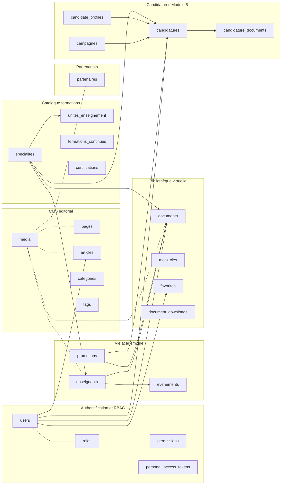

# Modèle de données — pssfp.net

> **Référence** : Sprint Specs A2
> **Statut** : v1.1 — décisions du 5 mai 2026 intégrées
> **Date** : 2026-05-05
> **Auteur** : M. ABE ETOUMOU Anatole (USI)
> **Base** : PostgreSQL 16 (cf. ADR-0002)
> **ORM** : Laravel 11 / Eloquent

Ce document décrit le schéma complet de la base de données pour la Phase I du projet de refonte numérique du PSSFP, incluant le rapatriement du Module 5 (Candidatures). Il sert de source unique pour les migrations Laravel (`backend/database/migrations/`), les modèles Eloquent (`backend/app/Models/`), les Resources Filament (`backend/app/Filament/Resources/`) et le contrat API (`docs/api-contract.md`).

## Mises à jour v1.1 — décisions du 5 mai 2026

Ces décisions du Chef USI **prévalent** sur les sections détaillées ci-dessous lorsqu'il y a divergence. Elles seront fusionnées dans le corps du document à la prochaine révision (avant Sprint B).

**O1 — Tronc commun = année 1, spécialités = année 2.** Le tronc commun **n'est PAS** une entrée dans la table `specialites`. C'est la première année obligatoire et commune à tous les étudiants, suivie d'un choix de l'une des 5 spécialités en année 2. Conséquence sur le modèle :

- `unites_enseignement.specialite_id` devient **NULLABLE** : NULL = UE de tronc commun (semestres 1-2), NOT NULL = UE de spécialité (semestres 3-4).
- `documents.specialite_id` reste NULLABLE : NULL = document non rattaché à une spécialité (incluant docs de tronc commun, textes de loi généraux, etc.).
- `candidatures` : les vœux portent uniquement sur les 5 spécialités d'année 2. Les candidats demandent l'admission au cursus complet (incluant le tronc commun obligatoire).

**O2 — Slug unique global, mono-locale.** Tous les slugs deviennent `TEXT NOT NULL UNIQUE` (un seul slug par entité, identique dans toutes les locales). L'URL `/presentation` est la même en FR, EN, AR — seul le contenu (titre, body) est traduit. Plus simple, plus SEO-friendly. Tables impactées : `pages`, `articles`, `categories`, `tags`, `specialites`, `formations_continues`, `certifications`, `evenements`. Les colonnes existantes en JSONB sont à corriger en `TEXT` lors de la rédaction des migrations Laravel.

**O4 — Frais de candidature payables sur site à CREMINCAM (CREMINCAM).** Pas de paiement en ligne en V1 — le candidat se rend en agence CREMINCAM avec son numéro de candidature, paie en espèces, rapporte le récépissé bancaire. L'admin marque le paiement reçu dans Filament. Trois colonnes ajoutées à `candidatures` :

| Colonne | Type | Notes |
|---|---|---|
| frais_paiement_mode | TEXT NULL | CHECK IN ('cremincam_agence','en_ligne','autre') — V1 uniquement 'cremincam_agence' utilisé |
| frais_paiement_reference | TEXT NULL | N° de récépissé bancaire CREMINCAM |
| frais_paiement_date | DATE NULL | Date du versement |

`frais_paye` (BOOLEAN) reste — devient un dérivé `(frais_paiement_reference IS NOT NULL AND frais_paiement_date IS NOT NULL)`. Saisie manuelle par l'admin Filament.

**O6 — Audit Joomla 5 mai 2026 — extension du modèle `documents`.** Suite à l'audit de l'ancienne biblio (cf. `docs/migration-joomla/audit-biblio-joomla.md`), trois colonnes ajoutées à la table `documents` :

| Colonne | Type | Notes |
|---|---|---|
| `subtitle` | JSONB NULL | TR — sous-titre Alexandria. À évaluer : si < 5% des ouvrages ont un subtitle non vide, concat au title. |
| `price_xaf` | BIGINT NULL | Prix en FCFA centimes — préparation Phase II monétisation. NULL = gratuit. |
| `external_url` | TEXT NULL | Pour ouvrages hébergés ailleurs (Alexandria `external_url`). |

L'enum `documents.type` est étendu à **10 valeurs** : `these`, `memoire`, `article_scientifique`, `texte_loi`, `cours`, `acte_conference`, `rapport_stage`, `bulletin`, `ressource_pedagogique`, **`ouvrage_numerique`** (nouveau, pour les manuels Alexandria type Exercices Corrigés Finances Publiques LMD).

**O5 — Stockage PDF et fichiers : MinIO local primaire + Scaleway Object Storage backup.** Recommandation actée :

- **Primaire** : MinIO auto-hébergé sur le VPS Contabo, S3-compatible, exposé sur `127.0.0.1:9000` derrière Nginx avec URL signées Laravel. Coût : 0 € récurrent (déjà inclus dans le VPS), 100% souveraineté, latence excellente pour les utilisateurs camerounais.
- **Backup** : Scaleway Object Storage Bucket `s3.fr-par.scw.cloud`, cible des backups `laravel-backup` (BDD `pg_dump` + dossier MinIO), rétention 30 jours, ~2-5 €/mois selon volume. C'est le DR géographique externe au Cameroun.
- **Buckets** :
  - `pssfp-media` (public read) — images CMS, logos, photos institutionnelles.
  - `pssfp-documents` (private) — PDF biblio, accessibles uniquement via URL signées temporelles côté Laravel.
  - `pssfp-candidatures` (private) — pièces jointes candidatures, accessibles uniquement par le candidat propriétaire et le comité d'admission.
  - `pssfp-backups` (Scaleway uniquement) — dumps quotidiens.

Cette décision remplace le placeholder du Domaine 9 § Annexe.

## Sommaire

1. Conventions transverses
2. Diagramme global par domaine
3. Domaine 1 — Authentification et RBAC
4. Domaine 2 — CMS éditorial
5. Domaine 3 — Catalogue formations
6. Domaine 4 — Vie académique
7. Domaine 5 — Partenariats
8. Domaine 6 — Bibliothèque virtuelle
9. Domaine 7 — Candidatures (Module 5)
10. Domaine 8 — Contact, paramètres, audit, redirections
11. Préparation Phase II (placeholders)
12. Récapitulatif des tables et compteur
13. Notes d'implémentation Laravel

---

## 1. Conventions transverses

Ces règles s'appliquent à toutes les tables sauf mention contraire explicite. Toute exception doit être justifiée dans un ADR ou dans une note locale au tableau de la table concernée.

**Clés primaires**. Chaque table porte une colonne `id` de type `BIGSERIAL` (auto-incrément) qui sert de clé interne pour les jointures. Les entités exposées publiquement (slug-routées) portent en plus une colonne `uuid` de type `UUID` (default `gen_random_uuid()`) avec un index UNIQUE — c'est cet UUID qui apparaît dans l'API publique, jamais le `id` interne. Cette double-clé évite l'énumération des contenus et donne une surface stable côté frontend.

**Slugs**. Pour les entités routées par URL (pages, articles, spécialités, documents, etc.), on stocke un slug par locale dans une colonne `slug JSONB`. Exemple : `{"fr": "presentation", "en": "about"}`. Un index GIN expression-based assure l'unicité par locale : `CREATE UNIQUE INDEX pages_slug_fr_unique ON pages ((slug->>'fr'))`. Le slug FR est obligatoire au lancement, EN/AR sont nullables.

**Champs traduisibles**. Pour les colonnes textuelles destinées à l'affichage (titre, description, body, label, etc.), le stockage utilise `JSONB` avec la convention `{"fr": "...", "en": null, "ar": null}`. L'extraction se fait via `spatie/laravel-translatable`. Toutes les colonnes traduisibles sont marquées **TR** dans les tableaux. Une absence de valeur dans une locale fait fallback sur `fr`.

**Soft deletes**. Toutes les entités éditoriales et métier portent une colonne `deleted_at TIMESTAMPTZ NULL` (Eloquent SoftDeletes). Les tables purement techniques (pivots, logs, sessions, jobs) n'en portent pas.

**Timestamps**. `created_at TIMESTAMPTZ NOT NULL DEFAULT now()` et `updated_at TIMESTAMPTZ NOT NULL DEFAULT now()` partout, mis à jour automatiquement par Eloquent.

**Auditabilité**. Les entités sensibles portent en plus `created_by BIGINT NULL` et `updated_by BIGINT NULL` qui référencent `users.id` — alimentés par un trait Eloquent `Auditable`. Le détail granulaire des changements (qui, quand, quoi) est tracé par `spatie/activitylog` sur `activity_log`.

**Statut éditorial**. Les contenus publiables portent `status` (enum) avec valeurs `draft` (par défaut), `in_review`, `published`, `archived`. Une colonne `published_at TIMESTAMPTZ NULL` permet la programmation de publication.

**i18n**. Cf. ADR-0006. Stockage JSONB, fallback FR, structure prête EN/AR.

**Nommage**. Tables au pluriel snake_case (`articles`, `unites_enseignement`). Pivots au format alphabétique singulier (`article_tag`, `enseignant_specialite`). Colonnes en snake_case (`published_at`, `featured_image_id`). Enums en MAJUSCULES dans les contraintes CHECK.

**Types PostgreSQL**. Préférer `TIMESTAMPTZ` sur `TIMESTAMP` (timezone explicite, fuseau Africa/Douala par défaut côté Laravel). Préférer `TEXT` sur `VARCHAR(n)` sauf justification (les VARCHAR PostgreSQL n'apportent rien sur la performance). `BOOLEAN` strict (PostgreSQL n'a pas de `TINYINT(1)`). `BIGINT` pour les FK (correspond à `BIGSERIAL`).

**Contraintes**. Les FK sont systématiquement `ON DELETE` documentées : `RESTRICT` par défaut, `CASCADE` pour les pivots et descendances naturelles (ex: `article_tag` cascade depuis `articles`), `SET NULL` quand l'enfant doit survivre à la suppression du parent (ex: `articles.author_id → users`). Les enums sont implémentés via colonnes `TEXT` + contraintes `CHECK (col IN (...))` plutôt que via le type `ENUM` PostgreSQL natif (plus simple à modifier en migration).

**Index**. FK indexées systématiquement. Slugs et colonnes `published_at` indexées (les listes triées chronologiquement sont fréquentes). Recherche full-text via Meilisearch (cf. ADR-0003) ; la BDD ne porte que des index trigrammes (`pg_trgm`) sur quelques colonnes spécifiques pour le fallback.

---

## 2. Diagramme global par domaine



Les flèches pleines représentent des relations FK obligatoires ou principales. Les pointillés (-.-) représentent des relations polymorphes ou des associations Spatie (rôles, permissions, médias attachés à plusieurs types d'entités).

---

## 3. Domaine 1 — Authentification et RBAC

Six rôles applicatifs sont définis (cf. ADR-0004 et ADR-0005) : `admin`, `editor`, `librarian`, `admission_committee`, `teacher`, `auditor`. Un septième rôle implicite `public` correspond à l'absence d'authentification. Le rôle `candidate` est traité différemment — un candidat est un `user` avec un `candidate_profile` lié, mais sans rôle Spatie attribué (ses droits dérivent uniquement de la possession d'un profil de candidat actif).

### `users`

Table centrale des comptes utilisateurs. Sert tous les rôles authentifiables.

| Colonne | Type | Contraintes | Notes |
|---|---|---|---|
| id | BIGSERIAL | PK | |
| uuid | UUID | UNIQUE, default gen_random_uuid() | Exposé en API |
| email | TEXT | UNIQUE, NOT NULL | Lower-cased à l'écriture |
| email_verified_at | TIMESTAMPTZ | NULL | Standard Laravel |
| password | TEXT | NOT NULL | Argon2id |
| first_name | TEXT | NOT NULL | |
| last_name | TEXT | NOT NULL | |
| phone | TEXT | NULL | Format E.164 |
| avatar_path | TEXT | NULL | Chemin Spatie Media |
| auth_provider | TEXT | NOT NULL DEFAULT 'local' | CHECK IN ('local','moodle_sso') — préparation Phase II |
| external_id | TEXT | NULL | ID externe pour SSO Moodle Phase II |
| two_factor_secret | TEXT | NULL | Encrypted, TOTP |
| two_factor_recovery_codes | TEXT | NULL | Encrypted JSON array |
| two_factor_confirmed_at | TIMESTAMPTZ | NULL | |
| last_login_at | TIMESTAMPTZ | NULL | |
| last_login_ip | INET | NULL | |
| locked_until | TIMESTAMPTZ | NULL | Lockout après échecs login |
| failed_login_attempts | SMALLINT | NOT NULL DEFAULT 0 | |
| created_at | TIMESTAMPTZ | NOT NULL | |
| updated_at | TIMESTAMPTZ | NOT NULL | |
| deleted_at | TIMESTAMPTZ | NULL | |

**Indexes** : `email` UNIQUE, `uuid` UNIQUE, `(auth_provider, external_id)` partial index WHERE external_id IS NOT NULL.
**Relations** : hasOne `candidate_profiles`, hasMany `articles` (author), hasMany `documents` (uploaded_by), hasMany `favorites`, belongsToMany `roles` via Spatie.

### `personal_access_tokens` (Sanctum)

Table standard Sanctum, créée par la migration officielle. Champs : `id`, `tokenable_type`, `tokenable_id`, `name`, `token` (hash), `abilities` (JSON), `last_used_at`, `expires_at`, timestamps. Les abilities suivent la liste de l'ADR-0005 (`library:read:restricted`, `application:create`, etc.).

### `roles`, `permissions`, `model_has_roles`, `model_has_permissions`, `role_has_permissions`

Tables standard `spatie/laravel-permission`. Schéma par défaut du package, non détaillé ici. Le rôle `admin` est le rôle technique le plus privilégié, équivalent à un super-admin Filament avec toutes permissions. Les permissions atomiques sont nommées au format `{ressource}.{action}` : `pages.create`, `documents.publish`, `candidatures.review`, etc.

### `password_reset_tokens`

Table standard Laravel pour la récupération de mot de passe via lien email. Token signé, validité 60 minutes (cf. ADR-0005).

### `sessions`

Table standard Laravel utilisée par Filament pour les sessions navigateur admin (cf. ADR-0005, piste 1).

---

## 4. Domaine 2 — CMS éditorial

Couvre les pages institutionnelles, les actualités, les taxonomies (catégories, tags) et la médiathèque.

### `pages`

Pages institutionnelles éditables via Filament. Couvre `/pssfp/*`, `/mentions-legales`, `/confidentialite`, `/plan-du-site`, etc.

| Colonne | Type | Contraintes | Notes |
|---|---|---|---|
| id | BIGSERIAL | PK | |
| uuid | UUID | UNIQUE | |
| parent_id | BIGINT | FK pages, NULL, ON DELETE RESTRICT | Hiérarchie pages |
| slug | JSONB | NOT NULL | TR — `{"fr": "presentation", ...}` |
| title | JSONB | NOT NULL | TR |
| excerpt | JSONB | NULL | TR — résumé pour SEO |
| body | JSONB | NULL | TR — contenu Markdown ou HTML structuré |
| meta_title | JSONB | NULL | TR |
| meta_description | JSONB | NULL | TR |
| og_image_id | BIGINT | FK media, NULL | Image Open Graph |
| status | TEXT | NOT NULL DEFAULT 'draft' | CHECK IN ('draft','in_review','published','archived') |
| published_at | TIMESTAMPTZ | NULL | |
| order | INT | NOT NULL DEFAULT 0 | Tri menu |
| is_in_menu | BOOLEAN | NOT NULL DEFAULT false | Apparait dans la navigation principale |
| menu_label | JSONB | NULL | TR — label court pour menu |
| created_by | BIGINT | FK users, NULL | |
| updated_by | BIGINT | FK users, NULL | |
| created_at, updated_at, deleted_at | | | |

**Indexes** : UNIQUE expression `(slug->>'fr')`, GIN sur `slug`, `(status, published_at)`, `parent_id`.
**Relations** : belongsTo self (parent), hasMany self (children).

### `articles`

Articles d'actualités, billets de blog, communiqués. Catégorisés et taggés.

| Colonne | Type | Contraintes | Notes |
|---|---|---|---|
| id | BIGSERIAL | PK | |
| uuid | UUID | UNIQUE | |
| slug | JSONB | NOT NULL | TR |
| title | JSONB | NOT NULL | TR |
| excerpt | JSONB | NULL | TR |
| body | JSONB | NULL | TR |
| featured_image_id | BIGINT | FK media, NULL ON DELETE SET NULL | |
| category_id | BIGINT | FK categories, NULL ON DELETE SET NULL | |
| author_id | BIGINT | FK users, NULL ON DELETE SET NULL | Rédacteur |
| status | TEXT | NOT NULL DEFAULT 'draft' | CHECK IN ('draft','in_review','published','archived') |
| published_at | TIMESTAMPTZ | NULL | |
| views_count | INT | NOT NULL DEFAULT 0 | Compteur |
| is_pinned | BOOLEAN | NOT NULL DEFAULT false | Mise en avant accueil |
| meta_title | JSONB | NULL | TR |
| meta_description | JSONB | NULL | TR |
| created_by, updated_by | BIGINT | FK users | |
| created_at, updated_at, deleted_at | | | |

**Indexes** : UNIQUE expression `(slug->>'fr')`, `(status, published_at DESC)`, `category_id`, `author_id`, `is_pinned WHERE is_pinned = true`.
**Relations** : belongsTo `categories`, belongsTo `users` (author), belongsToMany `tags` via `article_tag`, morphMany Spatie Media.

### `categories`

Taxonomie hiérarchique pour les articles (événements, formations, partenariats, résultats, vie académique — cf. CDC §8.1 Module 2).

| Colonne | Type | Contraintes | Notes |
|---|---|---|---|
| id | BIGSERIAL | PK | |
| slug | JSONB | NOT NULL UNIQUE expression | TR |
| name | JSONB | NOT NULL | TR |
| description | JSONB | NULL | TR |
| color | TEXT | NULL | Hex sans # |
| icon | TEXT | NULL | Nom d'icône Lucide |
| parent_id | BIGINT | FK categories, NULL | Hiérarchie |
| order | INT | NOT NULL DEFAULT 0 | |
| created_at, updated_at | | | |

**Indexes** : UNIQUE expression `(slug->>'fr')`, `parent_id`.

### `tags`

Tags transverses pour les articles et autres contenus.

| Colonne | Type | Contraintes | Notes |
|---|---|---|---|
| id | BIGSERIAL | PK | |
| slug | JSONB | NOT NULL UNIQUE expression | TR |
| name | JSONB | NOT NULL | TR |
| created_at, updated_at | | | |

### `article_tag`

Pivot articles ↔ tags. Colonnes : `article_id BIGINT FK ON DELETE CASCADE`, `tag_id BIGINT FK ON DELETE CASCADE`. PK composite.

### `media`

Table fournie par `spatie/laravel-medialibrary`. Schéma standard du package : `id`, `model_type`, `model_id` (polymorphe), `uuid`, `collection_name`, `name`, `file_name`, `mime_type`, `disk`, `conversions_disk`, `size`, `manipulations` (JSON), `custom_properties` (JSON), `generated_conversions` (JSON), `responsive_images` (JSON), `order_column`, timestamps. Les conversions automatiques générées sont `thumb` (200×200), `medium` (800×600), `large` (1920×1080), toutes en WebP.

---

## 5. Domaine 3 — Catalogue formations

Le PSSFP propose : un Master Professionnel (tronc commun + 5 spécialités), un catalogue de 10 modules de formation continue, et des certifications internationales (FMI/edX) avec voyages d'étude. Cette partie du modèle reflète la table 7 du CDC v5 (5 spécialités confirmées le 5 mai 2026).

### `specialites`

Les 5 filières du Master + une entrée optionnelle « Tronc commun » selon convention (le tronc commun peut aussi être traité comme un type particulier de spécialité, à trancher dans la spec module 1). Inscription dans la table : 5 spécialités numérotées 1 à 5 selon la table 7 du CDC.

| Colonne | Type | Contraintes | Notes |
|---|---|---|---|
| id | BIGSERIAL | PK | |
| uuid | UUID | UNIQUE | |
| code | TEXT | UNIQUE, NOT NULL | Court, ex: 'fiscalite', 'audit' |
| slug | JSONB | NOT NULL UNIQUE expression | TR |
| nom | JSONB | NOT NULL | TR — ex: « Fiscalité, Finance et Comptabilité Publique » |
| nom_court | JSONB | NOT NULL | TR — ex: « Fiscalité » pour menus |
| description_courte | JSONB | NULL | TR — résumé 200 caractères |
| description_longue | JSONB | NULL | TR — Markdown |
| debouches | JSONB | NULL | TR — array de strings traduisibles |
| color | TEXT | NULL | Hex sans # — pour cards et badges |
| icon | TEXT | NULL | Nom d'icône Lucide |
| illustration_id | BIGINT | FK media, NULL | Photo représentative |
| order | INT | NOT NULL DEFAULT 0 | |
| is_active | BOOLEAN | NOT NULL DEFAULT true | |
| meta_title | JSONB | NULL | TR |
| meta_description | JSONB | NULL | TR |
| created_at, updated_at, deleted_at | | | |

**Indexes** : UNIQUE `code`, UNIQUE expression `(slug->>'fr')`.
**Relations** : hasMany `unites_enseignement`, belongsToMany `enseignants` via `enseignant_specialite`, hasMany `documents`, hasMany `candidatures` (vœux 1, 2, 3).

### `unites_enseignement`

UE par spécialité, avec volume horaire et crédits ECTS.

| Colonne | Type | Contraintes | Notes |
|---|---|---|---|
| id | BIGSERIAL | PK | |
| uuid | UUID | UNIQUE | |
| specialite_id | BIGINT | FK specialites, NOT NULL ON DELETE CASCADE | |
| semestre | SMALLINT | NOT NULL | CHECK IN (1,2,3,4) — S1/S2 tronc, S3/S4 spécialité |
| code | TEXT | NOT NULL | Ex: 'UE-FIS-301' |
| intitule | JSONB | NOT NULL | TR |
| description | JSONB | NULL | TR |
| volume_horaire | INT | NULL | Heures totales |
| credits_ects | INT | NULL | Nombre de crédits |
| order | INT | NOT NULL DEFAULT 0 | |
| created_at, updated_at | | | |

**Indexes** : `specialite_id`, `(specialite_id, semestre, order)`.

### `formations_continues`

Catalogue des 10 modules de formation continue (table 8 du CDC v5).

| Colonne | Type | Contraintes | Notes |
|---|---|---|---|
| id | BIGSERIAL | PK | |
| uuid | UUID | UNIQUE | |
| slug | JSONB | NOT NULL UNIQUE expression | TR |
| numero | SMALLINT | NULL | Numéro catalogue 1-10 |
| intitule | JSONB | NOT NULL | TR |
| description | JSONB | NULL | TR |
| cibles | JSONB | NULL | TR — array de profils cibles |
| objectifs | JSONB | NULL | TR — array d'objectifs pédagogiques |
| programme | JSONB | NULL | TR — structure Markdown |
| duree_jours | SMALLINT | NULL | 3 à 5 jours |
| tarif_administration | INT | NULL | FCFA, par session |
| tarif_individu | INT | NULL | FCFA |
| tarif_auditeur_pssfp | INT | NULL | FCFA |
| illustration_id | BIGINT | FK media, NULL | |
| is_active | BOOLEAN | NOT NULL DEFAULT true | |
| order | INT | NOT NULL DEFAULT 0 | |
| created_at, updated_at, deleted_at | | | |

### `certifications`

Certifications internationales (FMI/edX) et voyages d'étude (Maroc, Expertise France).

| Colonne | Type | Contraintes | Notes |
|---|---|---|---|
| id | BIGSERIAL | PK | |
| uuid | UUID | UNIQUE | |
| slug | JSONB | NOT NULL UNIQUE expression | TR |
| type | TEXT | NOT NULL | CHECK IN ('certification','voyage_etude') |
| nom | JSONB | NOT NULL | TR |
| partenaire_id | BIGINT | FK partenaires, NULL | FMI, edX, Institut Maroc |
| description | JSONB | NULL | TR |
| modalite | TEXT | NULL | CHECK IN ('presentiel','distanciel','hybride') |
| duree | TEXT | NULL | Texte libre |
| illustration_id | BIGINT | FK media, NULL | |
| is_active | BOOLEAN | NOT NULL DEFAULT true | |
| order | INT | NOT NULL DEFAULT 0 | |
| created_at, updated_at, deleted_at | | | |

---

## 6. Domaine 4 — Vie académique

Promotions, corps enseignant, calendrier académique.

### `promotions`

Les 13 promotions historiques + futures. Promotion = une cohorte annuelle d'admission au tronc commun.

| Colonne | Type | Contraintes | Notes |
|---|---|---|---|
| id | BIGSERIAL | PK | |
| uuid | UUID | UNIQUE | |
| numero | SMALLINT | NOT NULL UNIQUE | 1 à 13... |
| annee_debut | SMALLINT | NOT NULL | Ex: 2013 pour P1, 2025 pour P13 |
| annee_fin | SMALLINT | NULL | Année de fin (M2). NULL si en cours |
| status | TEXT | NOT NULL DEFAULT 'active' | CHECK IN ('active','en_cours','terminee','archivee') |
| nombre_etudiants | INT | NULL | Effectif à l'admission |
| description | JSONB | NULL | TR |
| photo_groupe_id | BIGINT | FK media, NULL | Photo collective |
| created_at, updated_at, deleted_at | | | |

**Indexes** : UNIQUE `numero`.

### `enseignants`

Corps enseignant — personnels permanents et vacataires. Affichés sur `/vie-academique/corps-enseignant` et liés aux spécialités.

| Colonne | Type | Contraintes | Notes |
|---|---|---|---|
| id | BIGSERIAL | PK | |
| uuid | UUID | UNIQUE | |
| user_id | BIGINT | FK users, NULL UNIQUE | Lien optionnel si compte authentifié |
| civilite | TEXT | NULL | Pr., Dr., M., Mme |
| prenom | TEXT | NOT NULL | |
| nom | TEXT | NOT NULL | |
| slug | TEXT | NOT NULL UNIQUE | Calculé `prenom-nom` |
| grade | JSONB | NULL | TR — Pr titulaire, Maître de conférences, etc. |
| qualifications | JSONB | NULL | TR — diplômes, titres |
| domaines | JSONB | NULL | TR — array de domaines |
| bio | JSONB | NULL | TR — Markdown |
| email | TEXT | NULL | Pas obligatoire (vie privée) |
| phone | TEXT | NULL | |
| photo_id | BIGINT | FK media, NULL | |
| chef_de_departement_specialite_id | BIGINT | FK specialites, NULL | Si chef de département |
| ordre_affichage | INT | NOT NULL DEFAULT 100 | |
| is_visible | BOOLEAN | NOT NULL DEFAULT true | Masquer du site public sans supprimer |
| created_at, updated_at, deleted_at | | | |

**Indexes** : `slug`, `chef_de_departement_specialite_id`.

### `enseignant_specialite`

Pivot enseignants ↔ spécialités. Un enseignant peut intervenir dans plusieurs filières.

| Colonne | Type | Contraintes | Notes |
|---|---|---|---|
| enseignant_id | BIGINT | FK ON DELETE CASCADE | |
| specialite_id | BIGINT | FK ON DELETE CASCADE | |
| role | TEXT | NULL | « Enseignant titulaire », « Vacataire », « Coordinateur UE » |
| created_at | | | |

PK composite `(enseignant_id, specialite_id)`.

### `evenements`

Calendrier académique : examens, soutenances, séminaires, événements MEDIAFIP, voyages d'étude.

| Colonne | Type | Contraintes | Notes |
|---|---|---|---|
| id | BIGSERIAL | PK | |
| uuid | UUID | UNIQUE | |
| slug | JSONB | NOT NULL UNIQUE expression | TR |
| titre | JSONB | NOT NULL | TR |
| description | JSONB | NULL | TR |
| type | TEXT | NOT NULL | CHECK IN ('examen','soutenance','seminaire','formation','voyage','autre') |
| starts_at | TIMESTAMPTZ | NOT NULL | |
| ends_at | TIMESTAMPTZ | NULL | |
| all_day | BOOLEAN | NOT NULL DEFAULT false | |
| location | JSONB | NULL | TR — texte libre |
| lat | NUMERIC(9,6) | NULL | Pour carte si applicable |
| lng | NUMERIC(9,6) | NULL | |
| illustration_id | BIGINT | FK media, NULL | |
| is_public | BOOLEAN | NOT NULL DEFAULT true | Public ou réservé inscrits |
| created_by | BIGINT | FK users, NULL | |
| created_at, updated_at, deleted_at | | | |

**Indexes** : `(starts_at)`, `(type, starts_at)`, `is_public WHERE is_public = true`.

---

## 7. Domaine 5 — Partenariats

### `partenaires`

Partenaires institutionnels (MINFI, MINESUP, UY2), techniques (Expertise France, Institut Maroc), académiques (FMI, edX, Assemblée nationale, réseau CEMAC).

| Colonne | Type | Contraintes | Notes |
|---|---|---|---|
| id | BIGSERIAL | PK | |
| uuid | UUID | UNIQUE | |
| slug | TEXT | NOT NULL UNIQUE | |
| nom | JSONB | NOT NULL | TR |
| type | TEXT | NOT NULL | CHECK IN ('institutionnel','technique','academique','client') |
| description | JSONB | NULL | TR |
| logo_id | BIGINT | FK media, NULL | SVG ou PNG HD |
| site_url | TEXT | NULL | Lien externe |
| convention_pdf_id | BIGINT | FK media, NULL | Convention scannée |
| order | INT | NOT NULL DEFAULT 0 | |
| is_featured | BOOLEAN | NOT NULL DEFAULT false | Affichage page d'accueil |
| is_active | BOOLEAN | NOT NULL DEFAULT true | |
| created_at, updated_at, deleted_at | | | |

**Indexes** : `(type, order)`, `is_featured WHERE is_featured = true`.

---

## 8. Domaine 6 — Bibliothèque virtuelle

Cf. CDC bibliothèque v2.0. Quatre niveaux d'accès : `public`, `auditor`, `teacher`, `librarian` (l'admin lit tout).

### `documents`

Cœur du catalogue. Un document = une thèse, un mémoire, un article scientifique, un texte législatif, un support de cours, un acte de conférence, un rapport de stage, un bulletin/newsletter, ou une ressource pédagogique enseignant.

| Colonne | Type | Contraintes | Notes |
|---|---|---|---|
| id | BIGSERIAL | PK | |
| uuid | UUID | UNIQUE | |
| slug | TEXT | NOT NULL UNIQUE | |
| type | TEXT | NOT NULL | CHECK IN ('these','memoire','article_scientifique','texte_loi','cours','acte_conference','rapport_stage','bulletin','ressource_pedagogique') |
| title | JSONB | NOT NULL | TR |
| subtitle | JSONB | NULL | TR |
| abstract | JSONB | NULL | TR — résumé |
| keywords | JSONB | NULL | TR — array de strings traduisibles |
| year | SMALLINT | NULL | Année de publication |
| language | TEXT | NOT NULL DEFAULT 'fr' | CHECK IN ('fr','en','ar','autre') |
| promotion_id | BIGINT | FK promotions, NULL | Pour thèses/mémoires |
| specialite_id | BIGINT | FK specialites, NULL | |
| journal | TEXT | NULL | Pour articles scientifiques |
| doi | TEXT | NULL | Si applicable |
| isbn | TEXT | NULL | Pour ouvrages |
| pages_count | INT | NULL | |
| file_path | TEXT | NULL | Chemin S3/MinIO du PDF |
| file_size_bytes | BIGINT | NULL | |
| file_checksum_md5 | TEXT | NULL | Vérification intégrité |
| has_ocr | BOOLEAN | NOT NULL DEFAULT false | OCR réalisé ou non |
| thumbnail_id | BIGINT | FK media, NULL | Aperçu première page |
| access_level | TEXT | NOT NULL DEFAULT 'public' | CHECK IN ('public','auditor','teacher','librarian') |
| status | TEXT | NOT NULL DEFAULT 'draft' | CHECK IN ('draft','in_review','published','archived') |
| published_at | TIMESTAMPTZ | NULL | |
| views_count | INT | NOT NULL DEFAULT 0 | |
| downloads_count | INT | NOT NULL DEFAULT 0 | |
| uploaded_by | BIGINT | FK users, NULL | Déposant |
| approved_by | BIGINT | FK users, NULL | Bibliothécaire valideur |
| approved_at | TIMESTAMPTZ | NULL | |
| imported_from_legacy | BOOLEAN | NOT NULL DEFAULT false | Issu de la migration |
| legacy_url | TEXT | NULL | Pour redirections 301 |
| created_at, updated_at, deleted_at | | | |

**Indexes** : `slug`, `(type, published_at DESC)`, `(specialite_id, year DESC)`, `(promotion_id)`, `(access_level)`, `status`, GIN trigramme sur `(title->>'fr')` pour fallback recherche.
**Relations** : belongsTo `specialites`, belongsTo `promotions`, hasMany `document_authors`, belongsToMany `mots_cles` via `document_mot_cle`, hasMany `document_downloads`, hasMany `favorites`.

### `document_authors`

Auteurs d'un document, ordonnés. Un auteur peut être un `enseignant_id`, un `user_id` (auditeur ayant déposé sa thèse), ou simplement un nom externe (article scientifique d'un auteur extérieur).

| Colonne | Type | Contraintes | Notes |
|---|---|---|---|
| id | BIGSERIAL | PK | |
| document_id | BIGINT | FK ON DELETE CASCADE | |
| enseignant_id | BIGINT | FK enseignants, NULL | Si auteur PSSFP enseignant |
| user_id | BIGINT | FK users, NULL | Si auteur PSSFP étudiant |
| author_name | TEXT | NULL | Nom littéral si auteur externe |
| author_affiliation | TEXT | NULL | Institution d'affiliation |
| order | SMALLINT | NOT NULL DEFAULT 1 | Ordre des auteurs |
| created_at | | | |

**Constraint** : exactement un parmi `enseignant_id`, `user_id`, `author_name` non NULL (CHECK).

### `mots_cles`

Taxonomie thésaurus PSSFP — mots-clés validés par le bibliothécaire pour normaliser l'indexation.

| Colonne | Type | Contraintes | Notes |
|---|---|---|---|
| id | BIGSERIAL | PK | |
| slug | TEXT | NOT NULL UNIQUE | |
| label | JSONB | NOT NULL | TR |
| parent_id | BIGINT | FK mots_cles, NULL | Hiérarchie thésaurus |
| created_at, updated_at | | | |

### `document_mot_cle`

Pivot. PK composite `(document_id, mot_cle_id)`, ON DELETE CASCADE.

### `favorites`

Documents favoris d'un utilisateur authentifié.

| Colonne | Type | Contraintes | Notes |
|---|---|---|---|
| user_id | BIGINT | FK users ON DELETE CASCADE | |
| document_id | BIGINT | FK documents ON DELETE CASCADE | |
| created_at | | | |

PK composite `(user_id, document_id)`.

### `document_downloads`

Logs de téléchargement pour analytics et statistiques Filament.

| Colonne | Type | Contraintes | Notes |
|---|---|---|---|
| id | BIGSERIAL | PK | |
| document_id | BIGINT | FK ON DELETE CASCADE | |
| user_id | BIGINT | FK users, NULL | NULL si téléchargement public anonyme |
| ip | INET | NULL | Pour stats géo |
| user_agent | TEXT | NULL | |
| signed_url_token | TEXT | NULL | Token URL signée utilisé |
| downloaded_at | TIMESTAMPTZ | NOT NULL DEFAULT now() | |

**Indexes** : `document_id`, `user_id`, `downloaded_at`.

### `search_logs` (optionnel Phase I, recommandé)

Pour identifier les recherches sans résultat et améliorer le thésaurus.

| Colonne | Type | Contraintes | Notes |
|---|---|---|---|
| id | BIGSERIAL | PK | |
| query | TEXT | NOT NULL | |
| filters | JSONB | NULL | |
| results_count | INT | NOT NULL | |
| user_id | BIGINT | FK users, NULL | |
| ip | INET | NULL | |
| searched_at | TIMESTAMPTZ | NOT NULL DEFAULT now() | |

---

## 9. Domaine 7 — Candidatures (Module 5 rapatrié Phase I)

Système complet de gestion des candidatures, avec espace candidat, workflow d'examen, et interface admin pour le comité d'admission. Remplace l'ancien formulaire Joomla `candidature.pfinancespubliques.org`.

### `campagnes_candidature`

Campagnes annuelles d'admission. Permet d'avoir simultanément la campagne 2026 (Promotion 14) ouverte et l'historique des campagnes passées fermées.

| Colonne | Type | Contraintes | Notes |
|---|---|---|---|
| id | BIGSERIAL | PK | |
| uuid | UUID | UNIQUE | |
| slug | TEXT | NOT NULL UNIQUE | Ex: 'campagne-2026' |
| nom | JSONB | NOT NULL | TR |
| description | JSONB | NULL | TR |
| promotion_id | BIGINT | FK promotions, NULL | Promotion ciblée |
| opens_at | TIMESTAMPTZ | NOT NULL | Ouverture des candidatures |
| closes_at | TIMESTAMPTZ | NOT NULL | Clôture |
| results_at | TIMESTAMPTZ | NULL | Date prévue d'annonce des résultats |
| status | TEXT | NOT NULL DEFAULT 'draft' | CHECK IN ('draft','open','closed','results_published','archived') |
| frais_candidature | INT | NULL | FCFA — frais de dossier si applicable |
| max_voeux | SMALLINT | NOT NULL DEFAULT 3 | Nombre de spécialités à classer |
| pieces_requises | JSONB | NULL | TR — array de descriptifs |
| created_by | BIGINT | FK users, NULL | |
| created_at, updated_at, deleted_at | | | |

### `candidate_profiles`

Profil candidat lié à un compte `users`. Un user peut avoir au plus un candidate_profile, et soumettre des candidatures dans plusieurs campagnes.

| Colonne | Type | Contraintes | Notes |
|---|---|---|---|
| id | BIGSERIAL | PK | |
| user_id | BIGINT | FK users UNIQUE NOT NULL ON DELETE CASCADE | |
| date_naissance | DATE | NULL | |
| lieu_naissance | TEXT | NULL | |
| nationalite | TEXT | NULL | ISO-3166-1 alpha-2 |
| genre | TEXT | NULL | CHECK IN ('M','F','autre') |
| situation_familiale | TEXT | NULL | |
| pays_residence | TEXT | NULL | ISO-3166 |
| ville_residence | TEXT | NULL | |
| adresse | TEXT | NULL | |
| profession_actuelle | TEXT | NULL | |
| employeur | TEXT | NULL | |
| anciennete_annees | SMALLINT | NULL | |
| diplome_max | TEXT | NULL | CHECK IN ('Licence','Master','Doctorat','autre') |
| etablissement_diplome | TEXT | NULL | |
| annee_diplome | SMALLINT | NULL | |
| created_at, updated_at | | | |

### `candidatures`

Une candidature = un dossier soumis par un candidat à une campagne, avec ses vœux de spécialité.

| Colonne | Type | Contraintes | Notes |
|---|---|---|---|
| id | BIGSERIAL | PK | |
| uuid | UUID | UNIQUE | |
| numero | TEXT | NOT NULL UNIQUE | Ex: 'C-2026-0042' — généré séquentiellement par campagne |
| campagne_id | BIGINT | FK campagnes_candidature NOT NULL | |
| candidate_profile_id | BIGINT | FK candidate_profiles NOT NULL | |
| voeu_1_specialite_id | BIGINT | FK specialites, NULL | Premier vœu |
| voeu_2_specialite_id | BIGINT | FK specialites, NULL | |
| voeu_3_specialite_id | BIGINT | FK specialites, NULL | |
| projet_professionnel | TEXT | NULL | Texte libre |
| motivation | TEXT | NULL | Texte libre |
| status | TEXT | NOT NULL DEFAULT 'draft' | CHECK IN ('draft','submitted','under_review','complement_requested','accepted','rejected','withdrawn') |
| submitted_at | TIMESTAMPTZ | NULL | Horodatage soumission |
| reviewed_at | TIMESTAMPTZ | NULL | Date prise de décision |
| reviewed_by | BIGINT | FK users, NULL | Membre du comité |
| decision_notification_sent_at | TIMESTAMPTZ | NULL | |
| frais_paye | BOOLEAN | NOT NULL DEFAULT false | Paiement frais dossier — non utilisé en V1 |
| recipisse_pdf_id | BIGINT | FK media, NULL | PDF du récépissé généré |
| created_at, updated_at, deleted_at | | | |

**Indexes** : UNIQUE `numero`, `(campagne_id, status)`, `candidate_profile_id`, `(submitted_at)`.
**Constraint** : `submitted_at IS NOT NULL` quand `status != 'draft'`.

### `candidature_documents`

Pièces jointes uploadées par le candidat (CV, copies diplômes, lettre, photo, etc.).

| Colonne | Type | Contraintes | Notes |
|---|---|---|---|
| id | BIGSERIAL | PK | |
| candidature_id | BIGINT | FK ON DELETE CASCADE | |
| type | TEXT | NOT NULL | CHECK IN ('cv','diplome','lettre_motivation','photo','piece_identite','releve_notes','autre') |
| label | TEXT | NULL | Description courte si type 'autre' |
| file_path | TEXT | NOT NULL | Chemin MinIO/S3 |
| file_name | TEXT | NOT NULL | Nom original |
| file_size_bytes | BIGINT | NOT NULL | |
| mime_type | TEXT | NOT NULL | |
| uploaded_at | TIMESTAMPTZ | NOT NULL DEFAULT now() | |

**Indexes** : `(candidature_id, type)`.

### `candidature_comments`

Commentaires internes du comité d'admission sur un dossier — non visibles du candidat.

| Colonne | Type | Contraintes | Notes |
|---|---|---|---|
| id | BIGSERIAL | PK | |
| candidature_id | BIGINT | FK ON DELETE CASCADE | |
| author_id | BIGINT | FK users NOT NULL | Membre comité |
| body | TEXT | NOT NULL | |
| is_internal | BOOLEAN | NOT NULL DEFAULT true | Si false, visible candidat (demande de complément) |
| created_at, updated_at | | | |

### `candidature_status_history`

Historique des changements de statut pour audit complet du parcours.

| Colonne | Type | Contraintes | Notes |
|---|---|---|---|
| id | BIGSERIAL | PK | |
| candidature_id | BIGINT | FK ON DELETE CASCADE | |
| from_status | TEXT | NULL | |
| to_status | TEXT | NOT NULL | |
| changed_by | BIGINT | FK users, NULL | NULL si transition automatique |
| reason | TEXT | NULL | Motif si applicable |
| changed_at | TIMESTAMPTZ | NOT NULL DEFAULT now() | |

---

## 10. Domaine 8 — Contact, paramètres, audit, redirections

### `contact_messages`

Messages reçus via le formulaire de contact `/contact`. Doublé par l'envoi email vers `contact@pssfp.net` mais conservé en BDD pour traçabilité et anti-spam.

| Colonne | Type | Contraintes | Notes |
|---|---|---|---|
| id | BIGSERIAL | PK | |
| uuid | UUID | UNIQUE | |
| name | TEXT | NOT NULL | |
| email | TEXT | NOT NULL | |
| phone | TEXT | NULL | |
| organisation | TEXT | NULL | |
| subject | TEXT | NOT NULL | |
| message | TEXT | NOT NULL | |
| ip | INET | NULL | |
| user_agent | TEXT | NULL | |
| handled_at | TIMESTAMPTZ | NULL | Marqué traité par admin |
| handled_by | BIGINT | FK users, NULL | |
| created_at | TIMESTAMPTZ | NOT NULL | |

**Indexes** : `(handled_at WHERE handled_at IS NULL)`, `(created_at DESC)`.

### `settings`

Configuration applicative key-value, éditable depuis Filament.

| Colonne | Type | Contraintes | Notes |
|---|---|---|---|
| key | TEXT | PK | Ex: 'site.title', 'home.hero_title' |
| value | JSONB | NOT NULL | Valeur sérialisée |
| group | TEXT | NULL | Pour regroupement UI Filament |
| label | TEXT | NULL | Description humaine |
| updated_at | TIMESTAMPTZ | NOT NULL | |

### `redirects`

Redirections 301 — utilisées pour la migration `pfinancespubliques.org` → `pssfp.net` et pour les changements de slugs.

| Colonne | Type | Contraintes | Notes |
|---|---|---|---|
| id | BIGSERIAL | PK | |
| from_path | TEXT | NOT NULL UNIQUE | Ex: `/index.php?option=com_content...` |
| to_path | TEXT | NOT NULL | Chemin nouveau site |
| status_code | SMALLINT | NOT NULL DEFAULT 301 | CHECK IN (301, 302) |
| host | TEXT | NULL | Si redirection cross-domain |
| hits_count | INT | NOT NULL DEFAULT 0 | |
| last_hit_at | TIMESTAMPTZ | NULL | |
| created_at, updated_at | | | |

### `activity_log`

Table standard `spatie/laravel-activitylog`. Schéma par défaut du package — non détaillé. Activée sur : `pages`, `articles`, `documents`, `candidatures`, `users`, `formations_continues`, `specialites`, `partenaires`, `evenements`. Rétention : 12 mois, purge mensuelle automatique.

### `failed_jobs`, `jobs`, `job_batches`, `cache`, `cache_locks`

Tables standard Laravel pour la gestion de queue (Redis) et du cache. Schéma par défaut.

---

## 11. Préparation Phase II (placeholders)

Tables créées en Phase I avec un schéma minimal pour préparer la Phase II sans migration cassante. Aucune logique métier n'est attachée à ces tables en Phase I — elles existent simplement pour stabiliser les FK.

### `subscriptions` (placeholder)

Pour les abonnements bibliothèque premium institutionnels (Phase II).

| Colonne | Type | Notes |
|---|---|---|
| id | BIGSERIAL | |
| uuid | UUID UNIQUE | |
| owner_type | TEXT | Polymorphe : 'user' ou 'organisation' |
| owner_id | BIGINT | |
| plan | TEXT | |
| starts_at | TIMESTAMPTZ | |
| ends_at | TIMESTAMPTZ | |
| status | TEXT | |
| timestamps + soft delete | | |

### `transactions` (placeholder)

Pour les paiements Phase II (MTN MoMo, Orange Money, Stripe). Cf. ADR-0009 future quand spec module paiement sera détaillée.

| Colonne | Type | Notes |
|---|---|---|
| id | BIGSERIAL | |
| uuid | UUID UNIQUE | |
| user_id | BIGINT FK users NULL | |
| amount | INT | FCFA centimes |
| currency | TEXT | 'XAF' |
| channel | TEXT | mtn_momo, orange_money, stripe |
| status | TEXT | pending, processing, completed, failed, refunded |
| operator_reference | TEXT NULL | |
| idempotency_key | TEXT UNIQUE | |
| webhook_payload | JSONB NULL | |
| timestamps | | |

Aucune migration de logique en Phase I — tables créées vides, seuls les Resources Filament correspondants seront ajoutés en Phase II.

---

## 12. Récapitulatif des tables

| Domaine | Tables |
|---|---|
| 1. Auth & RBAC | `users`, `personal_access_tokens`, `roles`, `permissions`, `model_has_roles`, `model_has_permissions`, `role_has_permissions`, `password_reset_tokens`, `sessions` |
| 2. CMS éditorial | `pages`, `articles`, `categories`, `tags`, `article_tag`, `media` |
| 3. Catalogue formations | `specialites`, `unites_enseignement`, `formations_continues`, `certifications` |
| 4. Vie académique | `promotions`, `enseignants`, `enseignant_specialite`, `evenements` |
| 5. Partenariats | `partenaires` |
| 6. Bibliothèque | `documents`, `document_authors`, `mots_cles`, `document_mot_cle`, `favorites`, `document_downloads`, `search_logs` |
| 7. Candidatures | `campagnes_candidature`, `candidate_profiles`, `candidatures`, `candidature_documents`, `candidature_comments`, `candidature_status_history` |
| 8. Misc | `contact_messages`, `settings`, `redirects`, `activity_log`, `failed_jobs`, `jobs`, `job_batches`, `cache`, `cache_locks` |
| 9. Phase II | `subscriptions`, `transactions` |

**Total Phase I** : 41 tables actives + 2 placeholders Phase II = **43 tables**.

---

## 13. Notes d'implémentation Laravel

**Ordre des migrations.** L'ordre est contraint par les FK. Séquence recommandée pour le bootstrap initial :

1. `users` (sans FK vers media — la FK `avatar_path` est un chemin texte, pas une FK).
2. Tables Spatie permission (`roles`, `permissions`, pivots) via `php artisan permission:install`.
3. Tables Sanctum (`personal_access_tokens`) via la migration officielle.
4. Tables Spatie Media Library.
5. Tables Spatie Activity Log.
6. `categories`, `tags`, `partenaires`, `media` (déjà ci-dessus).
7. `pages` (parent_id self), `articles` (FK media, categories, users), `article_tag`.
8. `specialites`, `unites_enseignement`, `formations_continues`, `certifications`.
9. `promotions`, `enseignants`, `enseignant_specialite`, `evenements`.
10. `documents` (FK specialites, promotions), `document_authors`, `mots_cles`, `document_mot_cle`, `favorites`, `document_downloads`, `search_logs`.
11. `campagnes_candidature`, `candidate_profiles`, `candidatures`, `candidature_documents`, `candidature_comments`, `candidature_status_history`.
12. `contact_messages`, `settings`, `redirects`.
13. `subscriptions`, `transactions` (placeholders).

**Naming des fichiers de migration.** Format Laravel timestampé : `YYYY_MM_DD_HHMMSS_create_users_table.php`. Pour ce projet, on standardise les timestamps de bootstrap à partir de `2026_05_15_100000_*` (date arbitraire ultérieure à toutes les migrations standard Laravel/Spatie).

**Seeders minimaux à fournir au bootstrap.** Pour permettre `php artisan migrate:fresh --seed` reproductible :

- `RoleSeeder` — crée les 6 rôles Spatie.
- `AdminUserSeeder` — crée un compte admin technique pour M. ABE ETOUMOU avec mot de passe à changer au premier login.
- `SpecialiteSeeder` — insère les 5 spécialités du CDC table 7.
- `FormationContinueSeeder` — insère les 10 modules du CDC table 8.
- `PartenaireSeeder` — insère les partenaires institutionnels et techniques (table 11 et 12 du CDC).
- `PromotionSeeder` — insère les 13 promotions historiques.
- `SettingsSeeder` — insère les paramètres applicatifs par défaut.
- `CategorySeeder` — insère les catégories d'articles standards.

Les seeders ne contiennent **aucune donnée nominative réelle** (cf. règle CLAUDE.md racine). Pour le développement, un `DemoSeeder` distinct charge des fixtures via `factory()` — articles fake, documents biblio fake, candidats fake.

**Index supplémentaires à surveiller en exploitation.** Une fois le site en charge :

- Index B-tree sur `(campagne_id, status)` pour la liste de dossiers par campagne (Filament).
- Index trigramme sur `documents.title->>'fr'` pour le fallback recherche si Meilisearch tombe.
- Index partial sur `documents.access_level WHERE access_level != 'public'` pour les requêtes de vérification d'accès.

**Audit Spatie ActivityLog.** Activé via le trait `LogsActivity` sur les modèles. Configuration globale : log uniquement les changements de valeur (`logOnlyDirty()`), capture l'auteur (`causedBy(auth()->user())`), retient 12 mois de logs.

**Soft deletes et restauration.** Toutes les tables avec `deleted_at` portent un index partial : `CREATE INDEX ... WHERE deleted_at IS NULL` pour les requêtes courantes, sans index pour les éléments supprimés. Filament expose une action « Restaurer » pour les rôles `admin` et `editor` sur les contenus éditoriaux.

**Connexion à PostgreSQL.** Variables d'env standardes Laravel :

```
DB_CONNECTION=pgsql
DB_HOST=127.0.0.1
DB_PORT=5432
DB_DATABASE=pssfp
DB_USERNAME=pssfp_app
DB_PASSWORD=__a_definir_dans_env__
DB_CHARSET=utf8
```

Le user `pssfp_app` a uniquement les droits `CONNECT, USAGE, SELECT, INSERT, UPDATE, DELETE, REFERENCES` sur le schéma `public`. Un user `pssfp_admin` distinct est utilisé pour les migrations (droits DDL). Cette séparation limite l'impact d'une éventuelle injection SQL.

---

## Annexe — Décisions tranchées le 5 mai 2026

| ID | Question | Décision |
|---|---|---|
| O1 | Tronc commun comme spécialité ? | **Non** — tronc commun = année 1 obligatoire, 5 spécialités = année 2. UE et documents avec `specialite_id` NULLABLE. |
| O2 | Slugs par locale ou global ? | **Global** — `TEXT NOT NULL UNIQUE`, un seul slug par entité, identique dans toutes les locales. |
| O3 | Événements récurrents ? | **Reporté Phase II** — un événement = une instance en V1. Si besoin émerge, ajout colonne `rrule` RFC 5545 plus tard. |
| O4 | `frais_paye` sur candidatures ? | **Conservé** — paiement en agence CREMINCAM, saisie manuelle Filament. 3 colonnes ajoutées (mode, référence, date). |
| O5 | Stockage PDF biblio ? | **MinIO local primaire + Scaleway backup**. Détails dans la section « Mises à jour v1.1 » en haut du document. |

Toutes les décisions structurantes du modèle de données sont fermées pour V1. Les migrations Laravel peuvent être rédigées sur cette base lors du Sprint B.
